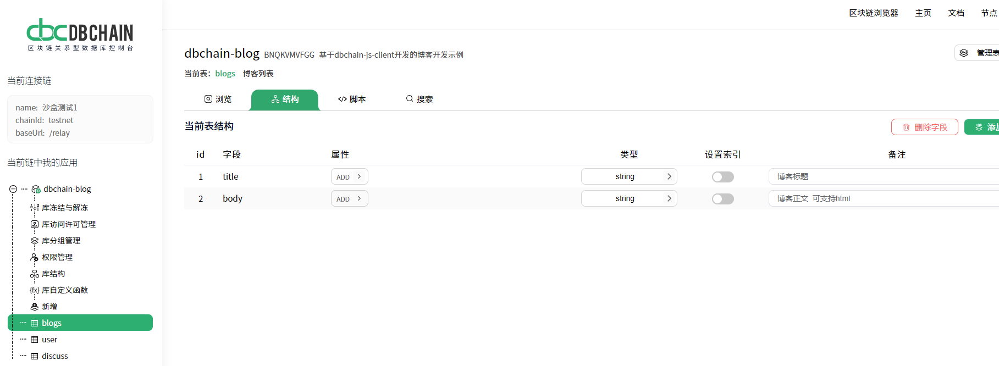

# 库链 dbchain-java-client、sm2-java-lib

---

库链 dbchain-java-client、sm2-java-lib 是库链客户端的 Java 实现。利用 dbchain-java-client、sm2-java-lib, 开发者们可以快速启动一个库链项目。

库链 dbchain-java-client、sm2-java-lib 提供了如下功能：

- 随机生成 DBChainKey（包含了助记词、密钥对）
- 导入助记词生成 DBChainKey
- 请求一个积分、获取积分数量
- 插入一行数据到表里
- 冻结表中的一行数据
- 获取表中拥有访问权限的所有行
- 按字段值搜索行/记录
- 打包消息（将多个操作放在一个交易里）

## 快速设置

### 1. 将 JitPack 存储库添加到您的构建文件中
```groovy
allprojects {
    repositories {
        ...
        maven { url 'https://jitpack.io' }
    }
}
```
### 2. 在 Module 中添加依赖
```groovy
dependencies {
    implementation 'com.github.dbchaincloud:dbchain-java-client:lastTag'
}
```
#### 2.1 Java 项目中使用
```groovy
dependencies {
    implementation 'com.github.dbchaincloud:sm2-java-lib:lastTag'
}
```
#### 2.2 Android 项目中使用
```groovy
dependencies {
    implementation('com.github.dbchaincloud:sm2-java-lib:lastTag') {
        exclude group: 'org.bouncycastle', module: 'bcprov-jdk15to18'
    }
}
```
### 3. 在 Application 中初始化 DBChain
```kotlin
// 控制台中创建数据库后，获取 appCode、baseUrl、chainId
// LogImpl 自定义实现日志输出
val appCode = "Your AppCode"
val baseUrl = "Your BaseUrl"
val chainId = "Your ChainId"
val debug = BuildConfig.DEBUG
com.gcigb.dbchain.init(
    appCodeParameter = appCode,
    baseUrlParameter = baseUrl,
    chainIdParameter = chainId,
    dbChainEncryptParameter = SM2Encrypt(),
    iLogParameter = LogImpl(),
    isDebug = debug,
)
```
### 4. 添加网络权限  

### 5. 获取到 DBChainKey 后，初始化到库中
```kotlin
withDBChainKey(dbChainKey)
```

## 使用方法

### 随机生成 DBChainKey（包含了助记词、密钥对）
```kotlin
val dbChainKey = generateMnemonic()
```

### 导入助记词生成 DBChainKey
```kotlin
val list = listOf(
        "tooth",
        "source",
        "tiny",
        "frost",
        "biology",
        "island",
        "tent",
        "alien",
        "sure",
        "easily",
        "fancy",
        "roast"
    )
val dbChainKey = importMnemonic(list)
```

### 请求一个积分
```kotlin
val requestAppUser = requestAppUser()
// 成功之后，需要等待几秒，积分才能到账
val result = requestAppUser.isSuccess
```

### 获取积分数量
```kotlin
val tokenAmount = getToken(address)
```

### 假设在控制台创建了一张表：blogs
 

### 插入一行数据到表里
```kotlin
val title = "世界上最好的语言是什么"
val body = "当然是Java"
val map = hashMapOf("title" to title, "body" to body)
insertRow("blogs",map)
```

### 冻结表中的一行数据
```kotlin
// 冻结 blogs 表中 id 为 1 的一行数据
freezeRow("blogs", "1")
```

### 获取表中拥有访问权限的所有行
```kotlin
val tableName = "blogs"
val queriedArray = QueriedArray(table = tableName)
querier(queriedArray)
```

### 按字段值搜索行/记录
#### 1. 根据 id 查行
```kotlin
val tableName = "blogs"
val queriedArray = QueriedArray(table = tableName).findById("3")
querier(queriedArray)
```
#### 2. 根据 title 查行
```kotlin
val tableName = "blogs"
val queriedArray = QueriedArray(table = tableName).findEqual("title","世界上最好的语言是什么")
querier(queriedArray)
```

### 打包消息（将多个操作放在一个交易里）
```kotlin
// 此示例将 3 个操作打包到一个交易里，要么都成功，要么都失败
// 插入了两行数据，冻结了一行 id 为 2 的数据
val tableName = "blogs"
val messageList = newMessageList().apply {
    add(createInsertMessage(tableName, mapOf("title" to "第一个博客", "body" to "第一个博客正文")))
    add(createInsertMessage(tableName, mapOf("title" to "第二个博客", "body" to "第二个博客正文")))
    add(createFreezeMessage(tableName, "2"))
}
handleBatchMessage(messageList)
```
